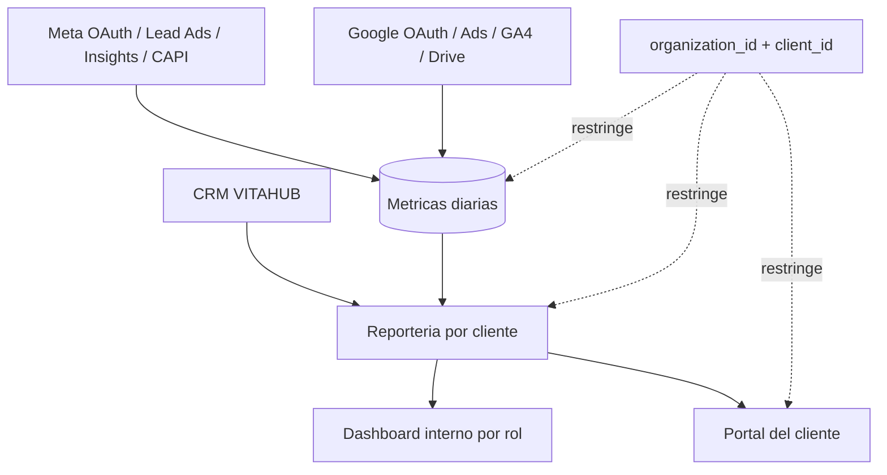

# Flujos operativos vigentes

ESTADO: VIGENTE
FUENTE: Documento Maestro de Operaciones + codigo actual de VITAHUB

## Flujo principal

```mermaid
flowchart LR
  Lead[Lead y origen] --> Sale[Cierre comercial]
  Sale --> Contract[Contrato y plan]
  Contract --> Onboarding[Onboarding y brief]
  Onboarding --> Strategy[Estrategia]
  Strategy --> Cycle[Ciclo mensual]
  Cycle --> Grid[Grilla y moodboard]
  Grid --> Production[Produccion]
  Production --> Approval[Validacion cliente]
  Approval --> Publish[Entrega o publicacion]
  Publish --> Results[Meta + Google + CRM]
  Results --> Report[Reporte mensual]
```

## Integraciones y aislamiento

## Regla de acceso

- Todo registro operativo pertenece a una organizacion.
- Todo dato visible al portal debe pertenecer al `clientId` del usuario autenticado.
- Las cuentas Meta y Google deben asignarse explicitamente a un cliente antes de sincronizar.
- La ausencia de datos externos se informa como no disponible; no se reemplaza con cero simulado.
